```{r, echo=FALSE, out.width="20%"}
htmltools::img(src = knitr::image_uri(f = "INPUT/IMAGES/Logo_Curso_Fuente_Datos_Biomedicas_Web_Semantica.png"), 
               alt = 'logo', 
               style = 'position:absolute; top:0; right:0; padding:10px;')
```

<style>
body {
text-align: justify}
</style>

```{r echo=FALSE, purl=FALSE}
# Paquetes para mejorar el aspecto de los html
# install.packages("devtools")
# devtools::install_github("hadley/emo")
library(emo) # Insert emoticons en el html. Nombres desde https://emoji.muan.co/ // https://github.com/hadley/emo
```

# Práctica GitHub
Realizaremos un pequeño ejercicio para mostrar la utilidad de Github en el control de versiones, incluso sin estar vinculado a un repositorio web.

Para ello deberéis descargar los siguientes ficheros: `Analysis.R` y `Datos.txt`.

De tal manera que en vuestro directorio de trabajo (una carpeta determinada a seleccionare por tí) sólo hayan estos dos archivos.

Ahora, tendremos que abrir la línea de comandos de nuestro sistema operativo; *i.e.* nuestra __terminal__ ó __terminal de comandos__.

En linux, esta terminal luciría así:

```{r, echo=FALSE, out.width="90%", fig.align = "center", fig.cap = 'Terminal de comandos en Linux'}
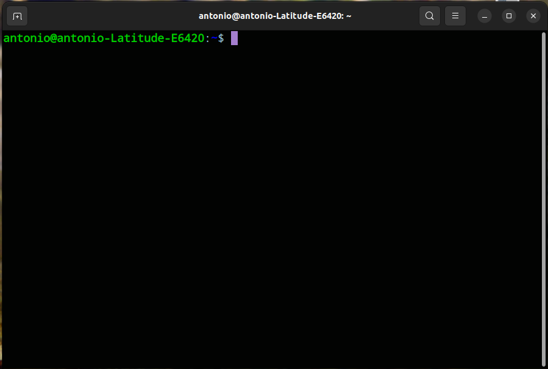
```

Si os dáis cuenta, el directorio de trabajo (donde está "leyendo" el sistema operativo) es diferente a donde tenemos la carpeta, para conocerlo podremos ejecutar lo siguiente:

*   `pwd` --> En linux(Mac)
*   `cd` --> En Windows

Y se vería ('*más o menos*') así:
```{r, echo=FALSE, out.width="90%", fig.align = "center", fig.cap = 'Terminal de comandos mostrando el directorio de trabajo'}
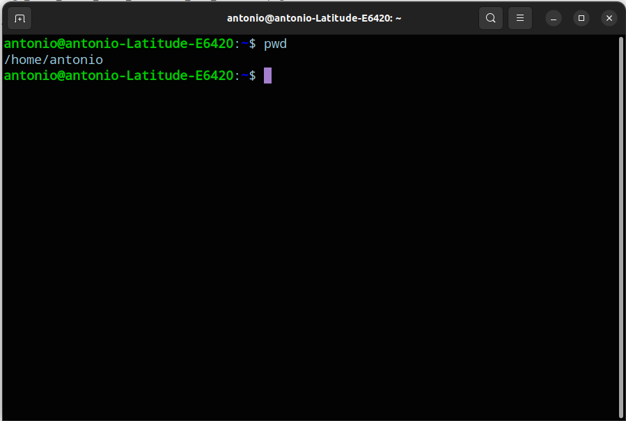
```

A continuación deberemos acceder a la carpeta donde tenemos los archivos (para desarrollar esta práctica), y para ello podremos seguir dos aproximaciones:

1.    Abrir la terminal desde la carpeta que contiene los ficheros `Analysis.R` y `Datos.txt`:
  1.1   Estando en `Linux`, en el navegador de ficheros en la carpeta correspondiente, podremos darle al botón del lado derecho y seleccionar "__*abrir en la terminal*__ (*open in terminal*)".
  1.2   Estando en `Windows`, en el navegador de ficheros en la carpeta correspondiente, podremos darle al botón del lado derecho y seleccionar "__*abrir ventana de comandos aquí*__ (*open git bash here*)".
  1.3   Estando en `Mac/iOs`, no e stan sencillo y las opciones serían: *i)* arrastrar la carpeta a la Terminal, y se completará la ruta de forma automática o *ii)* buscar en google "*cómo abrir la terminal en una carpeta en mac*"

2.    Abrir la terminal y navegar hasta la carpeta que contiene los ficheros `Analysis.R` y `Datos.txt`:
  2.1   Este será la aproximación en el curso ya que el comando (en los tres sistemas operativos) es `cd`, de *change directory*. En este caso cada uno de vosotros tendrá una ruta diferente, ya que tenemos una estructura de ficheros diferente.
  En mi caso la ruta luce como:
```{bash, engine.opts='-l', eval = FALSE}
cd Desktop/Practica_github/
```

Para corroborar que estamos en el lugar correcto, una manera de saberlo es nuevamente utilizar `pwd/cd` o bien listar el contenido de la carpeta usando los comandos `ls -l` (para Linux/Mac) o `dir` (Windows), tal que podréis ver algo como:

```{bash, engine.opts='-l', eval = FALSE}
ls -l
```

```{r, echo=FALSE, out.width="90%", fig.align = "center", fig.cap = 'Terminal de comandos mostrando el contenido de una carpeta'}
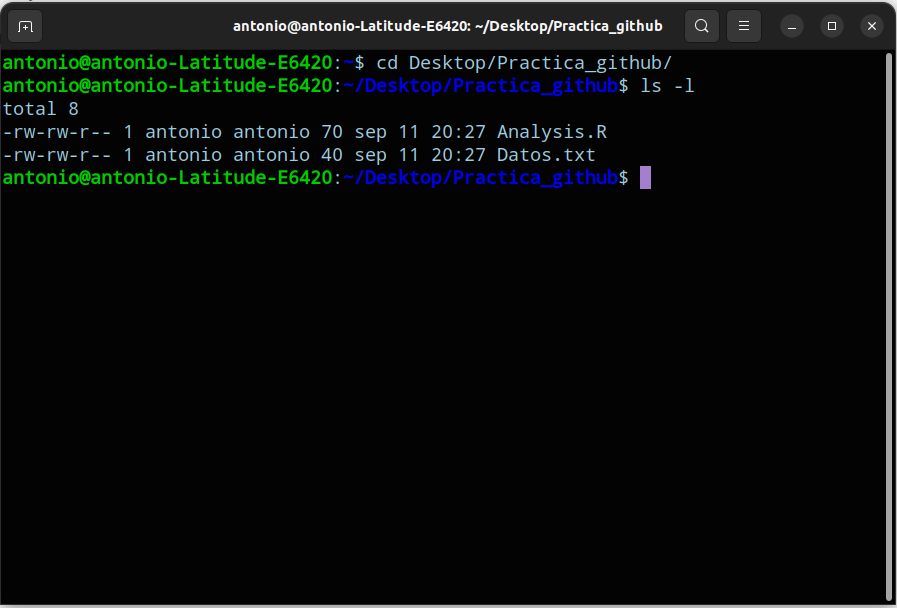
```

Bien, ahora que ya estamos en el lugar que corresponde y con los ficheros que corresponden, vamos a jugar un poco con los comandos básicos de Git.

<br>

# Comandos básicos de `Git`

## Inicializar `Git`
Si estamos en una carpeta que no está sincronizada con `git`, deberemos *advertirle* a `git` que esta carpeta deberá ser *vigilada* por él, esto es __inicializar__.

```{bash, engine.opts='-l', eval = FALSE}
git init
```

```{r, echo=FALSE, out.width="90%", fig.align = "center", fig.cap = 'Terminal de comandos mostrando la inicialización de un directorio cualquiera'}
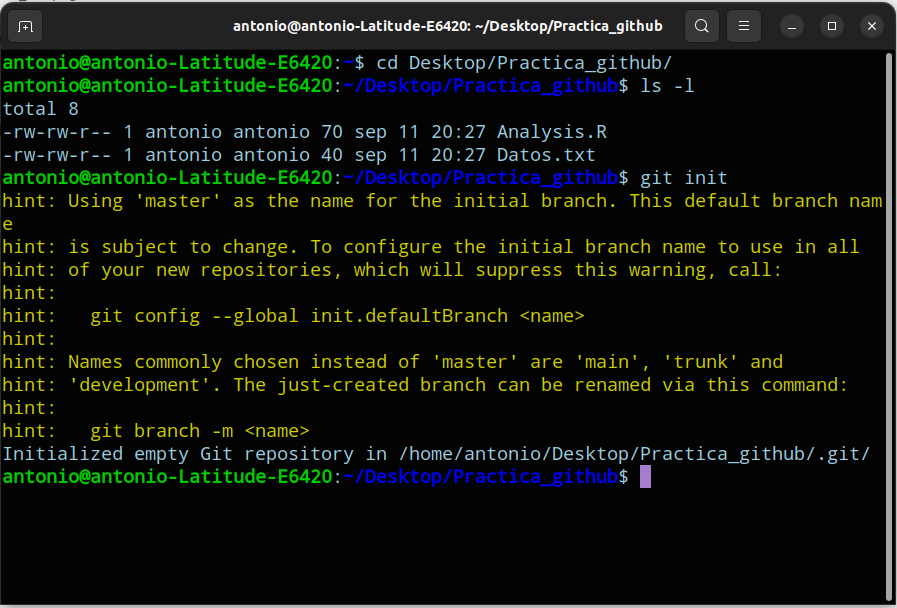
```

### Verificar el status
Verificamos el status usando el siguiente comando

```{bash, engine.opts='-l', eval = FALSE}
git status
```

```{r, echo=FALSE, out.width="90%", fig.align = "center", fig.cap = 'Terminal de comandos mostrando el estado del directorio'}
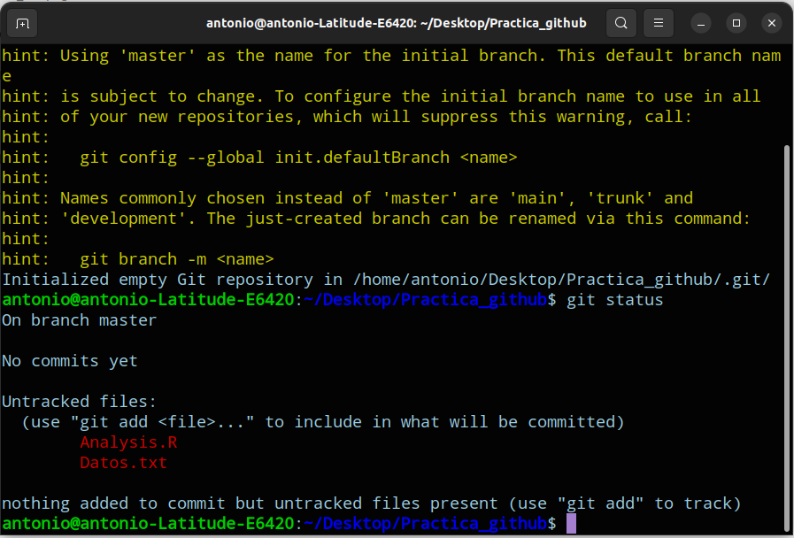
```

Vemos que hay archivos que no están siendo *vigilados/rastreados*. Para ello necesitaríamos incluirlos en el repositorio usando el comando `git add <<nombre_fichero1, nombre_fichero2, etc.>>` 

### Rastreo de ficheros/archivos 
Tal como se habló el primer día, sincronizaremos __TODO__ nuestro directorio, por lo que reemplazaremos los nombres de todos los archivos po el __*comodín*__ '__.__ (punto)' que significa *TODOS*, ejecutando:

```{bash, engine.opts='-l', eval = FALSE}
git add .
```

Si volvemos a ejecutar `git status`, obtenemos lo siguiente:

```{r, echo=FALSE, out.width="90%", fig.align = "center", fig.cap = 'Terminal de comandos mostrando el estado del directorio'}
knitr::include_graphics("INPUT/IMAGES/Git_add_status.png")
```

### Registro de cambios `commits` 
Ahora vemos que no hay archivos en color rojo o __*Untracked files*__. Ahora sí están siendo seguidos, pero los cambios no tienen un `commit` asociado y por eso nos advierte (coloreándolos en otro color, verde en este caso) que estos cambios han de ser *commited*.

Ejecutamos entonces lo siguiente:

```{bash, engine.opts='-l', eval = FALSE}
git commit -m "inicio del proyecto"
```

obteniendo la siguiente respuesta (lo que se ha ejecutado)

```{r, echo=FALSE, out.width="90%", fig.align = "center", fig.cap = 'Terminal de comandos mostrando el estado del directorio'}
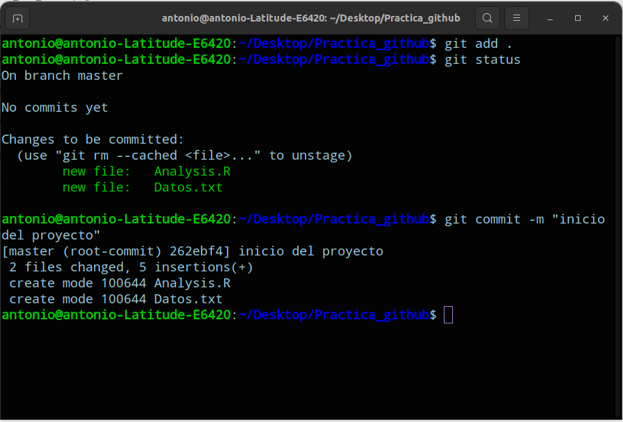
```

y ahora nuevamente....sí ¡has adivinado! --> ejecutamos `git status`.

```{r, echo=FALSE, out.width="90%", fig.align = "center", fig.cap = 'Terminal de comandos mostrando el estado del directorio'}
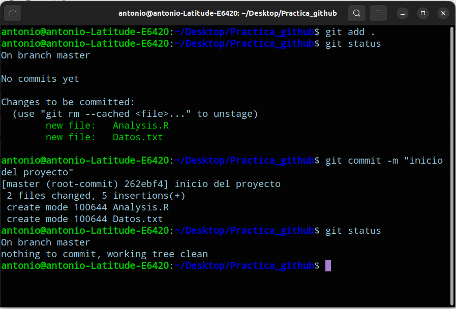
```

Finalmente obtenemos el mensaje que __sí queremos ver siempre__ que dice:

`On branch master`

`nothing to commit, working tree clean`


## Modificación de ficheros/archivos
Para demostrar la utilidad de `git`, vamos a realizar algunos pasos y su corespondiente rastreo.

### Modificar archivos
Vamos a abrir el fichero `Analysis.R` y vamos a modificarlo agregando un comentario en la primera línea.

Por lo que pasaremos de este archivo
```{r, echo=FALSE, out.width="90%", fig.align = "center", fig.cap = 'Script original'}
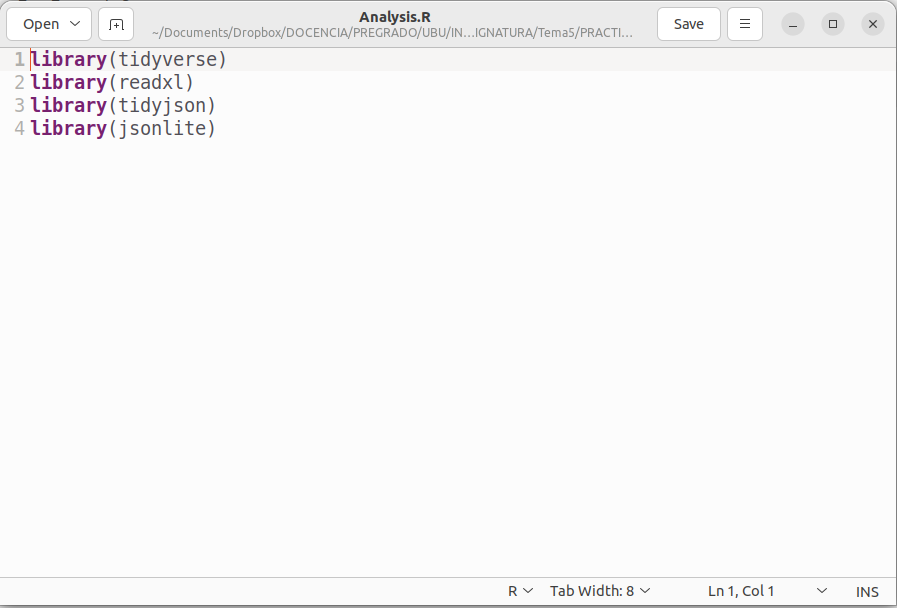
```

a este otro
```{r, echo=FALSE, out.width="90%", fig.align = "center", fig.cap = 'Script con la modificación. Haz de hacerla tú.'}
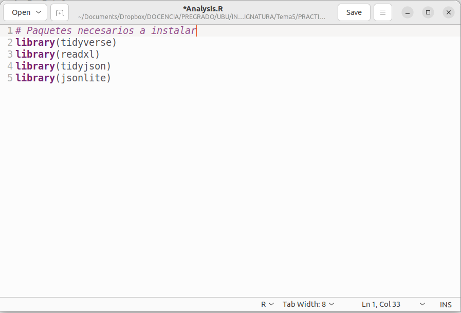
```

Ahora si volvemos a ejecutar `git status` obtenemos lo siguiente:
```{r, echo=FALSE, out.width="90%", fig.align = "center", fig.cap = 'Terminal mostrando los cambios realizados y los pasos necesarios a seguir.'}
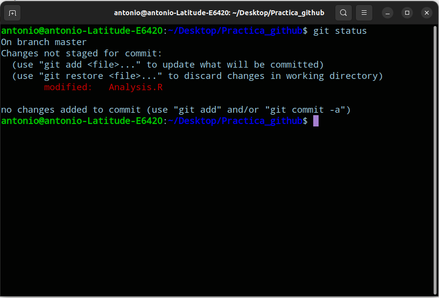
```

Como ya sabrás, necesitaremos __rastrear__ los cambios con `git add .` y registrar esos cambios con `git commit -m "texto"`.

```{bash, engine.opts='-l', eval = FALSE}
git add .
git commit -m "nuevo comentario en Analysis.R"
```

Obteniendo el siguiente mensaje:

```{r, echo=FALSE, out.width="90%", fig.align = "center", fig.cap = 'Terminal mostrando los cambios realizados.'}
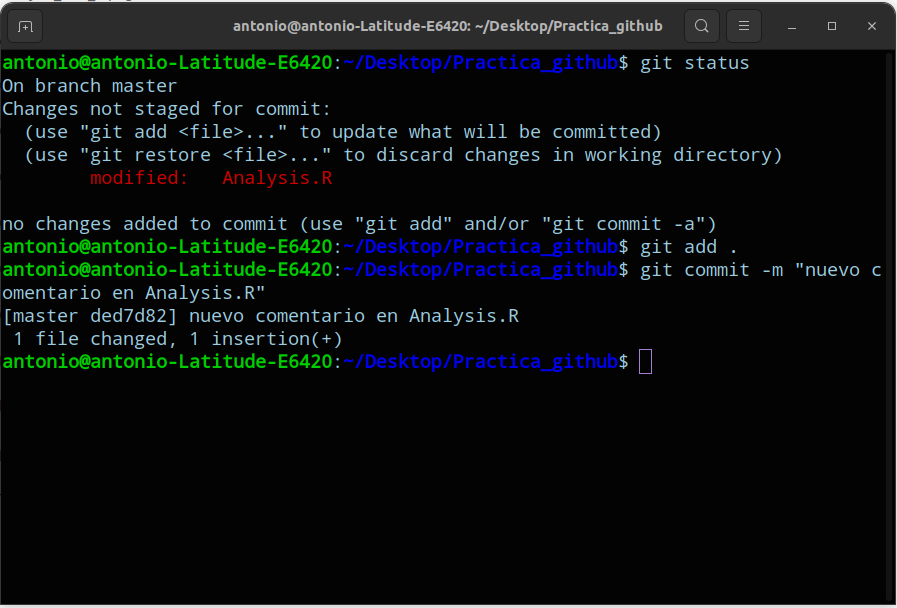
```

<br>

### Borrar archivos

Puede suceder que accidentalmente borremos/eliminemos un archivo. Veremos que gracias a `git` tenemos la capacidad de "*volver sobre nuestros pasos*" y reparar el "error" de haber borrado ese archivo.

Como al momento de borrar un archivo, es posible que hayamos (o no) hecho un `commit`, tendremos dos situaciones de recuperación.

<br>

#### Borrado de archivo sin commit.

Esta es la situación más fácil, ya que al no haber echo el `commit` solo necesitaremos el equivalente a un __*deshacer*__ (undo). En git, el comando para esto es `git stash`. Lo mostraremos a continuación.

Visualizamos nuevamente el contenido de nuestra carpeta usando los comandos `ls` o `dir` (dependiendo del sistema operativo).

```{bash, engine.opts='-l', eval = FALSE}
ls -l
```

```{r, echo=FALSE, out.width="90%", fig.align = "center", fig.cap = 'Terminal mostrando el contenido de nuestra carpeta'}
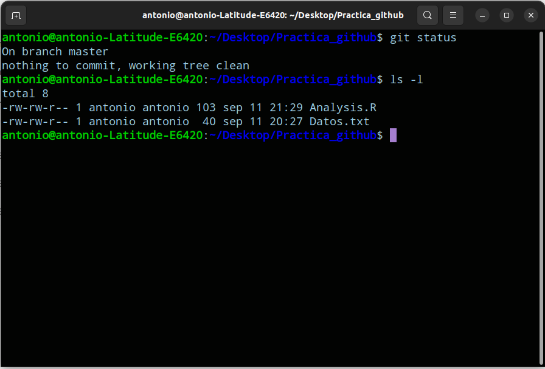
```

Vemos que en nuestra carpeta se lista el archivo `Analysis.R`; vamos a eliminarlo y listar los archivos después de su eliminación para ver si ha tenido efecto. En *Linux/Mac* el comando para borar archivos es `rm <nombre archivo>` y en *Windows* es `del "nombre archivo"`.

```{bash, engine.opts='-l', eval = FALSE}
rm Analysis.R
ls -l
```

```{r, echo=FALSE, out.width="90%", fig.align = "center", fig.cap = 'Terminal mostrando el contenido de nuestra carpeta'}
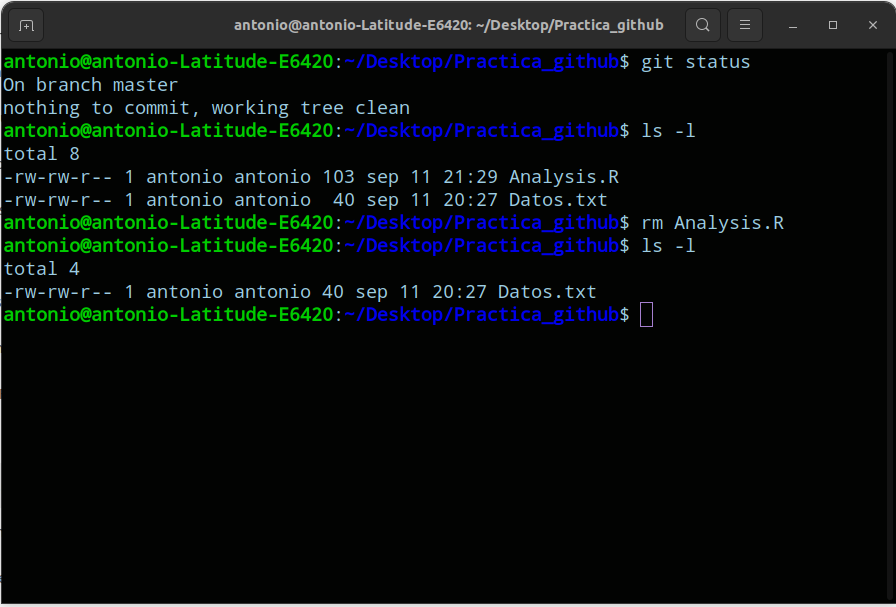
```

Vemos que el archivo `Analysis.R` ¡ha desaparecido!

Sin embargo, este cambio no está __*commited*__, por lo que dar un paso atrás es muy sencillo. Ejecutaremos el código  `git stash` y listaremos (nuevamente) los archivos disponibles para ver si ha tenido efecto.

```{bash, engine.opts='-l', eval = FALSE}
git stash
```

```{r, echo=FALSE, out.width="90%", fig.align = "center", fig.cap = 'Terminal mostrando el contenido de nuestra carpeta'}
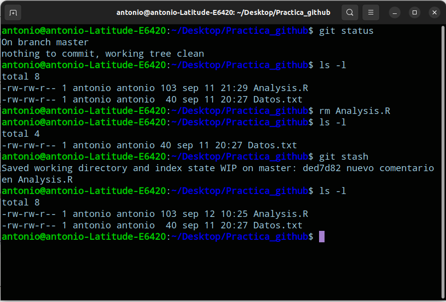
```

Como véis, hemos recibido un mensaje en la terminal y __hemos recuperado nuestro archivo__.

<br>

#### Borrado de archivo con commit.

Esta situación es un poco más complicada, pero quizás es la más habitual de suceder. Lo que haremos será borar el archivo, listar el contenido de la carpeta y mirar el status de la carpeta.

```{bash, engine.opts='-l', eval = FALSE}
rm Analysis.R
ls -l
git status
```

```{r, echo=FALSE, out.width="90%", fig.align = "center", fig.cap = 'Terminal mostrando el estado de nuestra carpeta'}
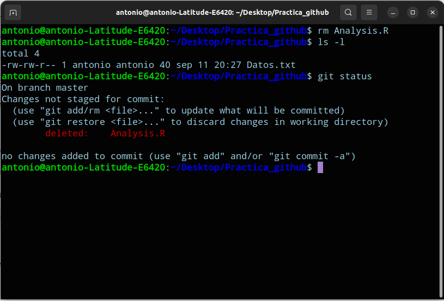
```

Procederemos entonces a "__rastrear__" e __identificar__ estos cambios con los siguientes comandos:

```{bash, engine.opts='-l', eval = FALSE}
git add .
git commit -m "Removed Analysis.R"
git stauts
```

```{r, echo=FALSE, out.width="90%", fig.align = "center", fig.cap = 'Terminal mostrando el estado de nuestra carpeta'}
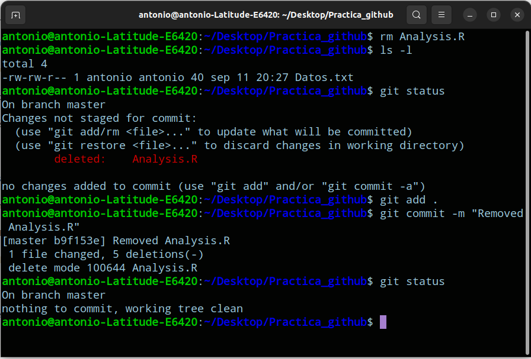
```

Nuestro archivo `Analysis.R` ya no está, pero __peor aún__ estos cambios han sido __rastreados__ (`git add`) y además identificado (`git commit`). Ahora mismo el comando `git stash` no tendría ninguna utilidad.

Como se ha comentado, el hecho de rastrear y de identificar los cambios (__*control de versionbes*__) aunque parezca engorroso es ¡*fantástico*!; ya que podremos controlar/observar los cambios que hemos realizado en nuestra carpeta y restaurar lo perdido.

Para esto necesitaremos *mirar* los cambios producidos y para eso ejecutamos

```{bash, engine.opts='-l', eval = FALSE}
git log
```

```{r, echo=FALSE, out.width="90%", fig.align = "center", fig.cap = 'Terminal mostrando el historial de cambios'}
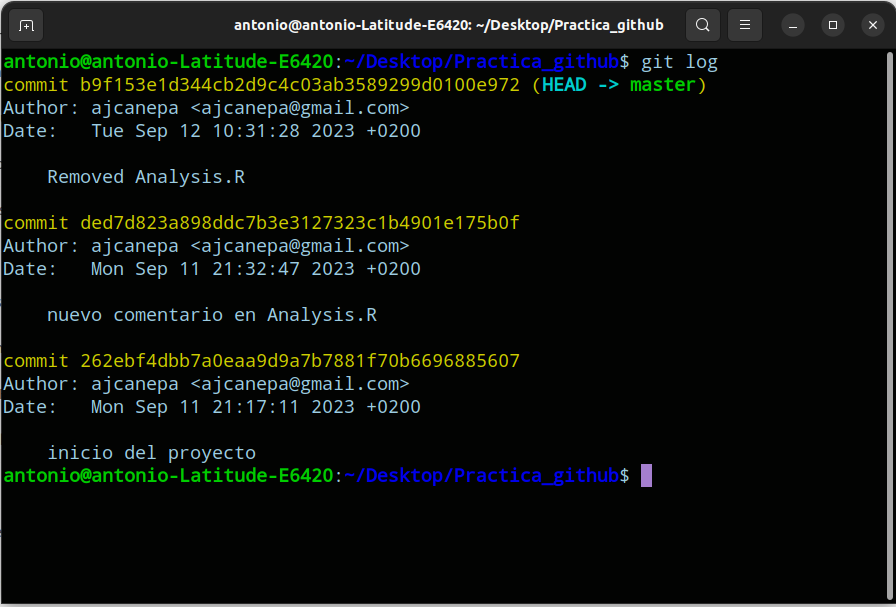
```

En este historial de cambios vemos los cambios más actuales "*más arriba*" o más cerca del comando `git log`. Lo importante es reconocer el __*Commit Unique Identifier*__ o *Identificador único de commits*. 

Este código alfanumérico se encuentra en la parte superior justo a la derecha de la palabra *commit*. En nuestro caso el commit que eliminó el archivo tiene el siguiente __*CUI*__:

*   __CUI__: `b9f153e1d344cb2d9c4c03ab3589299d0100e972`.

Para __revertir__ los cambios realizados usaremos el comando `git revert <CUI>`. Como véis en la sintaxis necesitamos el valor de ese CUI, pero si bien podemos copiar/pegar todo el código, con los primeros 10 dígitos valdría. ¿Quieres probarlo?


```{bash, engine.opts='-l', eval = FALSE}
git revert b9f153e1d344cb2d9c4c03ab3589299d0100e972
```

Al ejecutar `git revert <CUI>`, se nos abre una ventana de edición del commit, ya que debremos agregar un mensaje a esta decisión de revertir el commit, y ha de tener un commit ;) . 

Siempre es muy importante leer los mensajes que aparecen en pantalla.

```{r, echo=FALSE, out.width="90%", fig.align = "center", fig.cap = 'Terminal mostrando la ventana de edición del commit'}
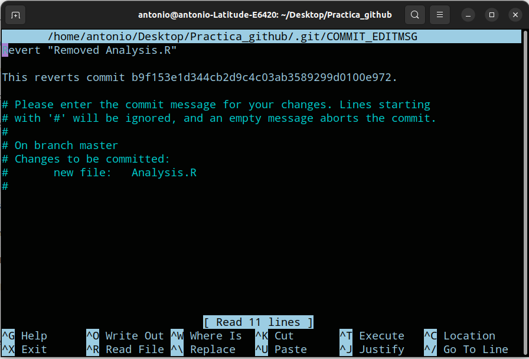
```

Lo que deberemos hacer ahora es escribir un mensaje (parte de él ya estaba escrito) y salir de esa pantalla. Para salir (u otras acciones), abajo de la pantalla tenemos el listado de comandos. el símbolo `^` significa `Ctrl` en windows/linux y `Command` en Mac.

Dejamos el mensaje de la siguiente manera:

```{r, echo=FALSE, out.width="90%", fig.align = "center", fig.cap = 'Terminal mostrando la ventana de edición del commit'}
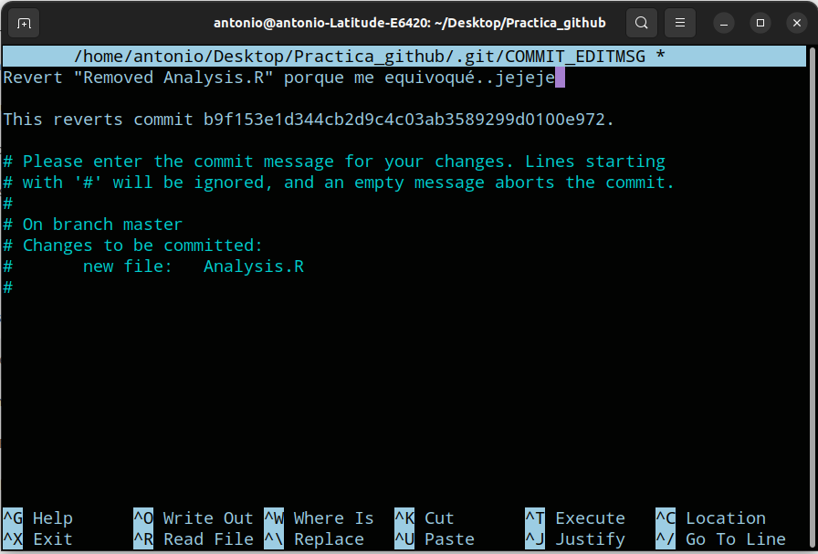
```

Y al momento de ejecutar `Ctrl + x`, salimos de la pantalla con la siguiente información en la terminal:

```{r, echo=FALSE, out.width="90%", fig.align = "center", fig.cap = 'Terminal mostrando el efecto de revert'}
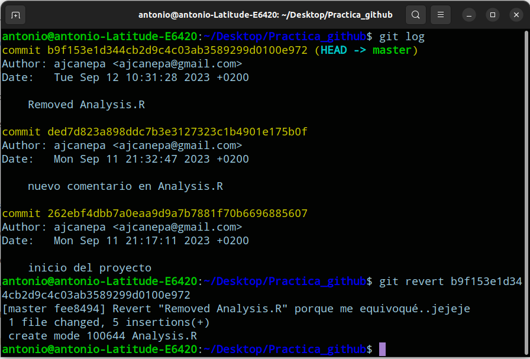
```

Para consluir podemos revisar los archivos contenidos en nuestra carpeta y cmprobar que ha tenido efecto.

```{bash, engine.opts='-l', eval = FALSE}
ls -l
git status
```

```{r, echo=FALSE, out.width="90%", fig.align = "center", fig.cap = 'Terminal mostrando el contenido de la carpeta y que está todo OK'}
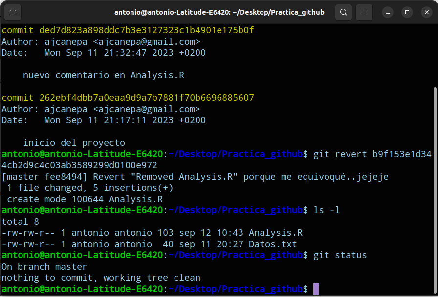
```

¡__Hemos terminado__!

***

<br>

# Licencia
__Autor__: Antonio Canepa Oneto

__Área__: Lenguajes y Sistemas Informáticos

__Departamento__: Ingeniería Informática

__Escuela Politécnica Superior, Universidad de Burgos (`r format(Sys.time(), '%Y')`)__

<br>

```{r, echo=FALSE, out.width="20%", fig.align='center', fig.cap= '', purl=FALSE}

```

Esta obra está bajo una licencia Creative Commons *Reconocimiento-NoComercial-CompartirIgual 3.0 Unported*.
No se permite un uso comercial de esta obra ni de las posibles obras derivadas, la distribución de las cuales se
debe hacer con una licencia igual a la que regula esta obra original.
Licencia disponible en [http://creativecommons.org/licenses/by-nc-sa/3.0/](http://creativecommons.org/licenses/by-nc-sa/3.0/) 